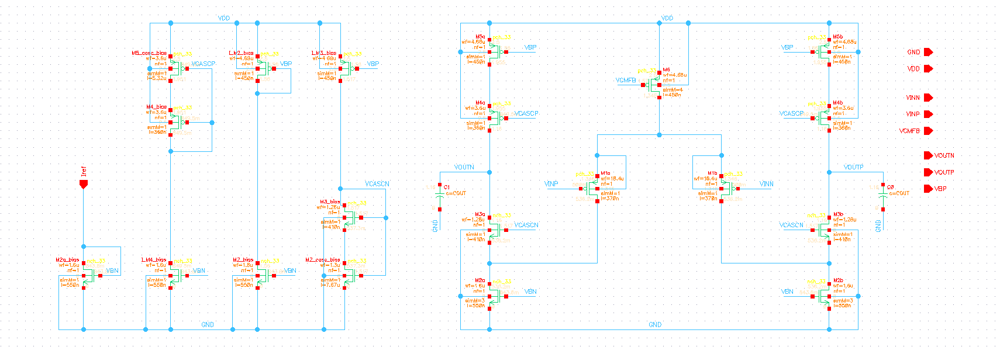
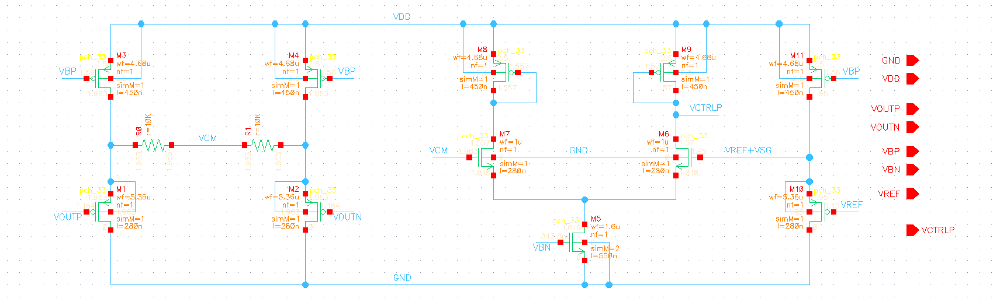
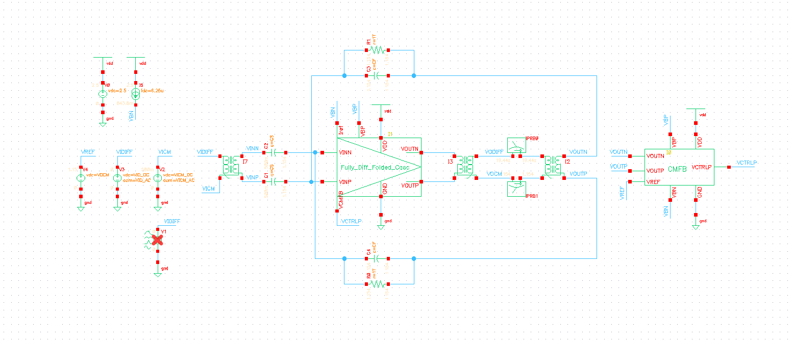

# Fully-Differential Folded Cascode OTA in GF180MCU

Transistor-level design, sizing, simulation, and verification of a fully-differential folded-cascode OTA with common-mode feedback in GF180MCU.

**ITI - Analog IC Design Internship Program** · Cairo University, Faculty of Engineering · Dept. of Electronics and Communications Engineering
**Instructor**: Dr. Hesham Omran

---

## Table of Contents
- [Overview](#overview)
- [Key Results](#key-results)
- [Architecture](#architecture)
  - [Top-Level Block Diagram](#top-level-block-diagram)
  - [OTA Core](#ota-core)
  - [Common-Mode Feedback (CMFB)](#common-mode-feedback-cmfb)
- [Design Methodology](#design-methodology)
- [Verification](#verification)
- [Repository Structure](#repository-structure)
- [Reproducing the Results](#reproducing-the-results)
- [Hand Analysis vs. Simulation](#hand-analysis-vs-simulation)
- [Design Decisions & Trade-offs](#design-decisions--trade-offs)
- [Team & Contributions](#team--contributions)

---

## Overview

This project implements a fully-differential folded-cascode operational transconductance amplifier (OTA) entirely at the transistor level in GF180MCU CMOS. The amplifier is designed for a 2.5 V supply and is placed in a closed-loop capacitive feedback configuration to achieve a precise closed-loop gain of 2.

To stabilize the output common-mode voltage, a dedicated transistor-level Common-Mode Feedback (CMFB) network is integrated. The circuit was systematically sized using the $g_m/I_D$ methodology, ensuring an optimal balance between bandwidth, stability, power consumption, and active silicon area.

---

## Key Results

| Metric | Value | Target Spec |
| :--- | :--- | :--- |
| **Technology** | GF180MCU | - |
| **Supply voltage** | 2.5 V | 2.5 V |
| **Closed-loop gain (DC)** | 1.998 V/V | 2 |
| **Phase margin @ $A_{CL}$** | 89.28° | $\ge 70°$ |
| **CL settling time (1% error)** | 98.19 ns | $\le 100$ ns |
| **Differential output swing** | 1.199 $V_{pk-pk}$ | 1.2 $V_{pk-pk}$ |
| **CM input range** | 0 V to 1.486 V | $\le 0$ V to $\ge 1$ V |
| **Open-loop DC gain** | 71.47 dB | 60 dB (Closed-loop target) |
| **Closed-loop GBW** | 16.85 MHz | - |
| **Total Average Power** | 172.7 µW | Minimize |
| **Total Active Area** | 46.25 µm² | Minimize |

---

## Architecture

### Top-Level Block Diagram

```text
       ┌─────────────────────┐
VINP ──┤                     ├── VOUTN
       │   Folded-Cascode    │
       │      OTA Core       │
VINN ──┤                     ├── VOUTP
       └─────────┬───────────┘
                 │ VCTRLP
       ┌─────────┴───────────┐
VOUTN ─┤                     │
       │     Common-Mode     │
VOUTP ─┤   Feedback (CMFB)   │
       │                     │
VREF ──┤                     │
       └─────────────────────┘
```

### OTA Core



- **Topology**: Fully-differential folded-cascode with a PMOS input pair.
- **Why PMOS?**: Required to satisfy the strictly low Common-Mode Input Range (CMIR) specification ($\le 0$ V), allowing the input to swing down to ground while keeping the tail current source in saturation.
- **Biasing**: Features a replica-diode biasing network to dynamically synthesize cascode gate voltages ($V_{CASCN}$, $V_{CASCP}$), ensuring accurate PVT tracking and maintaining maximum voltage swing margins.

### Common-Mode Feedback (CMFB)



- **Sensing**: Utilizes large (10 kΩ) resistors averaged across VOUTP and VOUTN to extract the common-mode level without heavily loading the differential AC loop.
- **Buffering**: Employs PMOS source-follower (CD) buffers to sense the output, preventing starvation of the buffers during maximum output excursions.
- **Error Amplifier**: A diode-loaded differential amplifier compares the buffered CM signal against a reference ($V_{REF}$) and drives the OTA's tail current source ($M_6$) to regulate the output CM level at precisely 1.15 V.

---

## Design Methodology

- **$g_m/I_D$ Lookup Tables (LUTs)**: Device characteristics ($V_A$, $W/I_D$, $f_T$, $V_{GS}$) were extracted using the ADT Sizing Assistant across varying channel lengths (280 nm to 5 µm) at a typical $V_{DSAT}$ of ~400 mV.
- **Input Pair Optimization**: Designed for maximum Figure of Merit ($FOM = f_T \cdot (g_m/I_D)$) at a short channel length ($L = 370$ nm) to maximize GBW and minimize input parasitic capacitance.
- **Cascode & Mirror Sizing**: Sized with long channels ($L \ge 360$ nm) and moderate inversion ($g_m/I_D = 10$) to maximize intrinsic gain ($g_m r_o$) and output resistance ($R_{out} \approx 23.7$ MΩ) while minimizing noise contributions.

---

## Verification

Performance characterization uses Cadence Spectre testbenches targeting open-loop and closed-loop behaviors.



| Analysis | Purpose |
| :--- | :--- |
| **DC Operating Point** | Verifies all transistors remain in deep saturation across the full input/output common-mode range. |
| **AC Analysis** | Extracts open-loop/closed-loop DC gain, Bandwidth (BW), and Unity Gain Frequency (UGF) sweeping from 1 Hz to 10 GHz. |
| **STB (Stability)** | Dual balun-injection probes (`iprobe`) measure Loop Gain and Phase Margin for both the primary differential loop and the CMFB loop simultaneously. |
| **Transient (Large Signal)**| Evaluates 1% settling time via a 100 mV step pulse, and verifies the 1.2 $V_{pk-pk}$ output swing via a 100 kHz sine wave. |

**Result**: The CMFB loop successfully tracks and rejects common-mode disturbances with an 87.1° phase margin, preventing dynamic CM drift.

---

## Repository Structure

```text
├── docs/
│   ├── Folded_Cascode_OTA Report.pdf       # Full project documentation and derivations
│   ├── hand_analysis.pdf                   # Theoretical derivations and calculations
│   └── aic_lab_cadence_mm_11_folded_v01.pdf# Original project spec sheet
├── simulations/
│   ├── part1_gmid_charts/                  # Extracted LUTs for GF180MCU devices
│   ├── part3_open_loop_behavioral_cmfb/    # Open-loop simulations (Ideal CMFB)
│   ├── part4_open_loop_actual_cmfb/        # Open-loop simulations (Real CMFB)
│   ├── part5_closed_loop_ac_stb/           # Closed-loop Cap-feedback STB/AC analysis
│   ├── part6_closed_loop_transient/        # Transient pulse and sine wave analysis
│   └── schematics_and_testbenches/         # Cadence schematic database (future use)
├── layout/                                 # Reserved for layout views
├── scripts/                                # Reserved for automation scripts
└── README.md
```

---

## Reproducing the Results

Requirements: Cadence Virtuoso, Spectre Simulator, GF180MCU PDK.

1. Open the project library in Virtuoso.
2. Navigate to the testbench schematic (e.g., Closed Loop TB).
3. Launch ADE L / ADE Explorer and load the corresponding state.
4. Run the **AC/STB** simulation to reproduce the >89° phase margin and 62.2 dB loop gain.
5. Run the **Transient** simulation with the configured 100 mV differential pulse to measure the <100 ns settling time.

---

## Hand Analysis vs. Simulation

Theoretical hand calculations matched Spectre simulations with high accuracy, validating the $g_m/I_D$ methodology framework.

| Parameter | Hand Analysis | Simulation | Error |
| :--- | :--- | :--- | :--- |
| **Open-Loop DC Gain** | 72.18 dB | 71.47 dB | ~1% |
| **Open-Loop GBW** | 54.59 MHz | 51.63 MHz | 5.4% |
| **Open-Loop Phase Margin** | 83.7° | 84.41° | < 1% |
| **Closed-Loop DC Gain** | 1.9985 V/V | 1.998 V/V | 0% |

*Note: Minor GBW deviations are attributed to junction/wiring capacitances and zero-shifting effects from the feedforward path through $C_f$ not captured in the simplified first-order calculations.*

---

## Design Decisions & Trade-offs

- **Split Ratio ($S = 2$)**: Routing double the current to the input pair relative to the cascode branches significantly boosted $G_m$ and open-loop gain while reducing input-referred noise. The trade-off was a slight reduction in non-dominant pole frequency, expertly balanced to maintain the >70° phase margin requirement.
- **Low-Gain CMFB Error Amplifier**: Diode-connected loads were used in the error amp to yield low intrinsic gain ($A_{err} \approx 1$). This pushed CMFB non-dominant poles to higher frequencies, ensuring absolute loop stability. The expected steady-state error was mitigated by sizing the error amplifier such that its quiescent output natively matched the required OTA tail bias.

---

## Team & Contributions

| Member | Contributions |
| :--- | :--- |
| **Adham Mohamed** | Full theoretical hand analysis, $g_m/I_D$ characterization, schematic capture, CMFB design, testbench simulation, and report documentation. |
